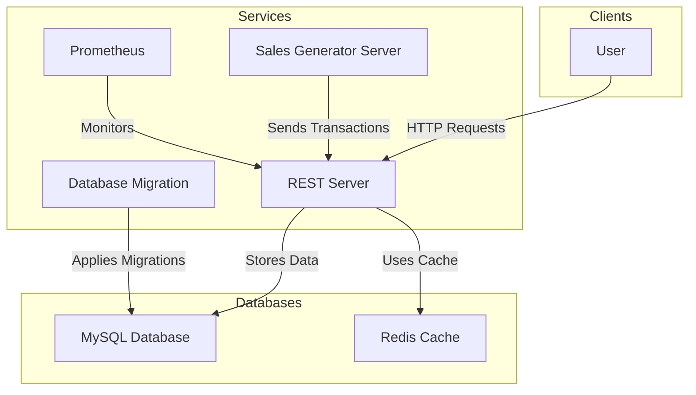
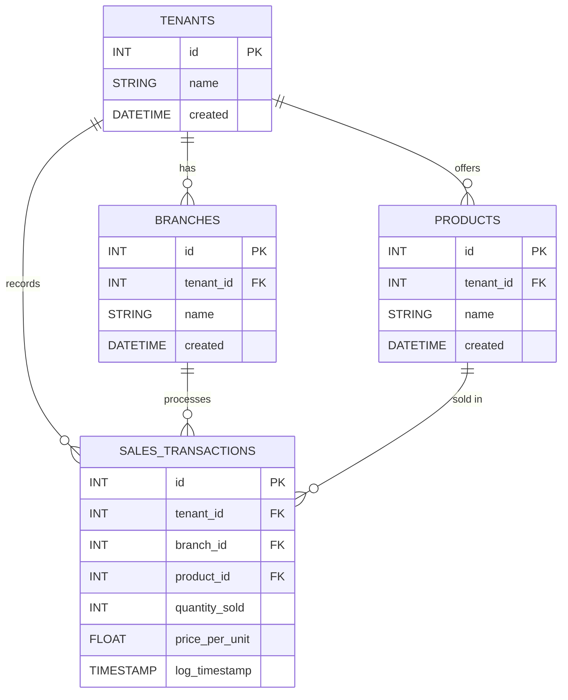

# transcation-processor
Multi-Tenant POS Transaction Processor

# Instructions

## Run
 - Install docker
 - Run docker
 - Go the project directory
 - type `docker compose up --build`

(it will take around 5-10 minutes to download, build and run images)

## Shutdown
 - type `docker compose down`
 - if you want to erase the data(volume) type `docker compose down -v`

# API

## API Endpoints

| Endpoint | Method | Description | Handler |
|----------|--------|-------------|---------|
| `/health` | `GET` | Health check for the service | `health` |
| `/v1/tenants/:tenantID/branches/:branchID/sales-transactions` | `POST` | Submit new sales transactions | `app.newSalesTransaction` |
| `/v1/tenants/:tenantID/sales` | `GET` | Retrieve total sales per product for a given tenant | `app.getSalesPerProduct` |
| `/v1/top-selling` | `GET` | Retrieve top-selling products across all tenants | `app.getTopSellingProducts` |
| `/metrics` | `GET` | Expose Prometheus metrics | `promhttp.Handler()` |

# System architecture

---

### **Explanation:**
- **Clients** (Users) interact with the **REST Server** via API requests.
- **SalesGenServer** Simulates users sending transactions to **REST Server**.
- **REST Server** processes transactions, using:
  - **MySQL** for data storage.
  - **Redis** for caching.
- **Migrate Service** runs database migrations on **MySQL** before the REST server starts.
- **Prometheus** monitors the REST API.

---

# Project structure

📦 Project Root  
- 📂 cmd
  - 📂 rest # REST API service  
  - 📂 salesgenerator # Sales data generator  
- 📂 internal  
  - 📂 cache # Redis or in-memory caching logic  
  - 📂 data # Database models & repository layer  
  - 📂 metrics # Monitoring & Prometheus integration  
  - 📂 validator # Request validation logic  
- 📂 migrations # Database migration files  

See https://go.dev/doc/modules/layout#server-project

# Database modeling

---

### **Entity Breakdown**
- **`tenants`** → Stores tenants (business owners) with `id`, `name`, and `created` timestamp.
- **`branches`** → Each tenant can have multiple branches.
- **`products`** → Each tenant has multiple products.
- **`sales_transactions`** → Tracks each sale, linking to a `tenant`, `branch`, and `product`.

---

# Optimizations

# Concurrency techniques used

# Trade-offs made between caching, transaction processing, and API design

# Todos
 - Refactor
    - encapsulate workers
    - encapsulate logger
    - add flags for configs
    - replace environment variables with flags
    - Move /metrics to a different/separate port e.g. 8081 (internal usage)
    - Move infra files to infra folder
 - Send email
 - Loom demo

# Q&A

Is it safe to commit the .env file?
no, this is to make the running steps easier. in production you shouldn't commit .env files.

# Next
- Kafka/RabbitMQ
- gRPC
- Kubernetes
- Load Testing
- Unit & Integration Testing
- Rate Limit
- Authentication & Authorization
- Physical & Logical Isolation
- Frontend (React, Hotwire)
