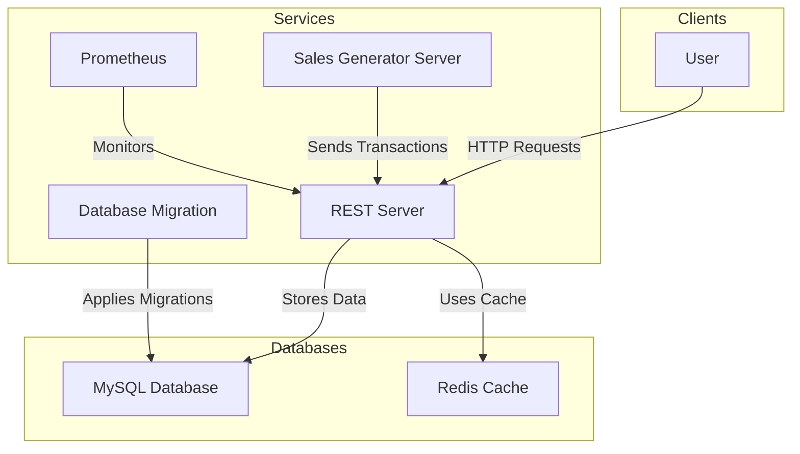
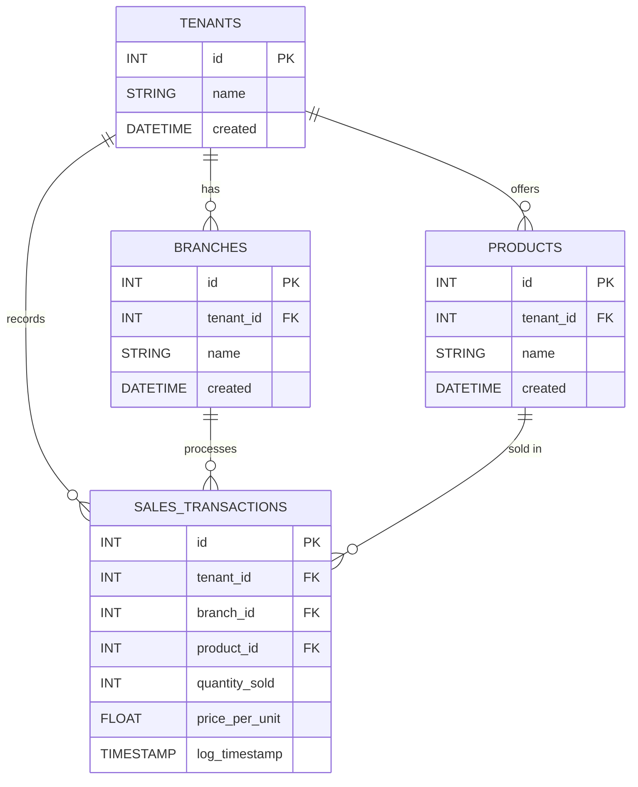
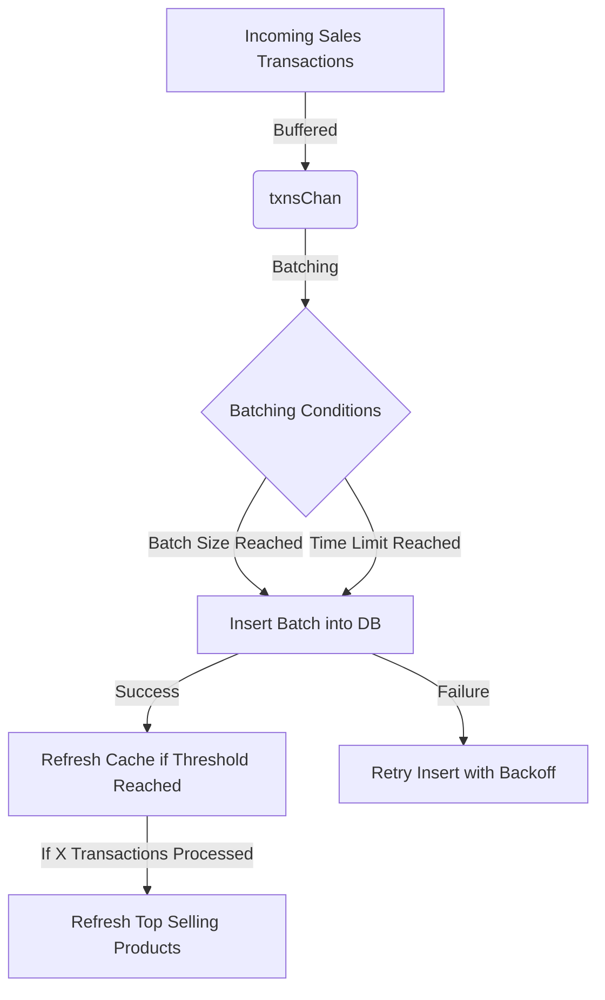

# transcation-processor
Multi-Tenant POS Transaction Processor

# Instructions

## Run
 - Install docker
 - Run docker
 - Go the project directory
 - type `docker compose up --build`

(it will take around 5-10 minutes to download, build and run images)

## Shutdown
 - type `docker compose down`
 - if you want to erase the data(volume) type `docker compose down -v`

# API

## API Endpoints

| Endpoint | Method | Description | Handler |
|----------|--------|-------------|---------|
| `/health` | `GET` | Health check for the service | `health` |
| `/v1/tenants/:tenantID/branches/:branchID/sales-transactions` | `POST` | Submit new sales transactions | `app.newSalesTransaction` |
| `/v1/tenants/:tenantID/sales` | `GET` | Retrieve total sales per product for a given tenant | `app.getSalesPerProduct` |
| `/v1/top-selling` | `GET` | Retrieve top-selling products across all tenants | `app.getTopSellingProducts` |
| `/metrics` | `GET` | Expose Prometheus metrics | `promhttp.Handler()` |

# System architecture

---

### **Explanation:**
- **Clients** (Users) interact with the **REST Server** via API requests.
- **SalesGenServer** Simulates users sending transactions to **REST Server**.
- **REST Server** processes transactions, using:
  - **MySQL** for data storage.
  - **Redis** for caching.
- **Migrate Service** runs database migrations on **MySQL** before the REST server starts.
- **Prometheus** monitors the REST API.

---

# Project structure

📦 Project Root  
- 📂 cmd
  - 📂 rest # REST API service  
  - 📂 salesgenerator # Sales data generator  
- 📂 internal  
  - 📂 cache # Redis or in-memory caching logic  
  - 📂 data # Database models & repository layer  
  - 📂 metrics # Monitoring & Prometheus integration  
  - 📂 validator # Request validation logic  
- 📂 migrations # Database migration files  

See https://go.dev/doc/modules/layout#server-project

# Database modeling

---

### **Entity Breakdown**
- **`tenants`** → Stores tenants (business owners) with `id`, `name`, and `created` timestamp.
- **`branches`** → Each tenant can have multiple branches.
- **`products`** → Each tenant has multiple products.
- **`sales_transactions`** → Tracks each sale, linking to a `tenant`, `branch`, and `product`.

---

# Optimizations
- Batching database writes
- Use Zap for logging (faster than the standard logger)
- Caching total sales per product (for a given tenant)
- Caching top selling products (across all tenants)

# Concurrency techniques used

---

### **Key Techniques Used:**
1. **Worker Pool Pattern**:  
   - Uses **5 concurrent workers** (`NumWorkers = 5`) to process transactions.
   - Workers run `aggregateTransactions()`.

2. **Buffered Channels** (`txnsChan`, `refreshChan`, `quitChan`):  
   - Used to handle transaction data flow efficiently.

3. **Batching Mechanism**:  
   - Batches transactions **every 100 items** (`BatchSize`) or **every 5 seconds** (`BatchTime`).

4. **Retries with Fixed Backoff**:  
   - `batchInsertWithRetry()` retries **3 times** with a **10-second delay**.

5. **Graceful Shutdown**:  
   - `stopWorkers()` closes channels and waits for workers to exit.

---

# Trade-offs made between caching, transaction processing, Database modeling, and API design

## Caching
- Total sales per product
  - expires after X minutes, X = 1
  - refreshed on request
  - advantage: reduce load on database
  - disadvantage: user may read old data (not real time)

- Top selling products
  - expiration 10 minutes
  - auto refreshed every X processed transactions, X = 1000
  - X should adapt to system traffic because it maybe called more than needed or may never get called

## Transaction Processing

- transactions currently is being processed by X workers, regardless where the transactions coming from(tenant, branch), workers are sharing same channel.
  - Advantage: keeping workers busy(optimizing resources)
  - Disadvantage: specific tenant or branch may take more resources than allowed

- Alternative: assign each branch it's own channel and set of workers
  - Advantage: control over resources per tenant/branch
  - Disadvantage: complexity, some branches may reserve workers but not use them

## Database Modeling

### Data Isolation
- Row-level security
  - Advantage: Simple queries
  - Advantage: Fast
  - Advantage: easy to apply migrations and schema updates
  - Disadvantage: relies on logical isolation, any bug in code could leak data e.g. in SQL forgetting to use "Where tenantID = ?"
  - Disadvantage: identifiers is shared across tenants e.g. tenant 1 has branch id 1 and 2, and tenant 2 has branch id 3 and 4 (can work around with string identifiers or creating a separate column)

- Alternative: schema/namespace level
  - Advantage: higher pyshical isolation
  - Advantage: Simpler for sharding or partitioning
  - Disadvantage: Schema updates need to reflect across all tenants tables

## API Design

### Advantages
- Levels e.g. tenants/?/branches/?/operation helps with isolation
- Versioning

### Disadvantages
- Some endpoints need to be more dynamic/generic/reusable e.g. /top-selling can have ?limit=1,10 (will give more flexibility but needs cache handling)
- Internal endpoints to be on a different port e.g. move prometheus /metrics to 8081

### Alternatives to REST API
REST API is not the best for our use case since the write endpoint is not waiting for a response we can go with event driven architecture and use message queues e.g. Kafka or RabbitMQ, Or we can go with gRPC if it's an internal service for performance.

# Todos
 - Refactor
    - encapsulate workers
    - encapsulate logger
    - add flags for configs
    - replace environment variables with flags
    - Move /metrics to a different/separate port e.g. 8081 (internal usage)
    - Move infra files to infra folder

# Next
- Kafka/RabbitMQ
- gRPC
- Kubernetes
- Load Testing
- Unit & Integration Testing
- Rate Limit
- Authentication & Authorization
- Physical & Logical Isolation
- Frontend (React, Hotwire)
